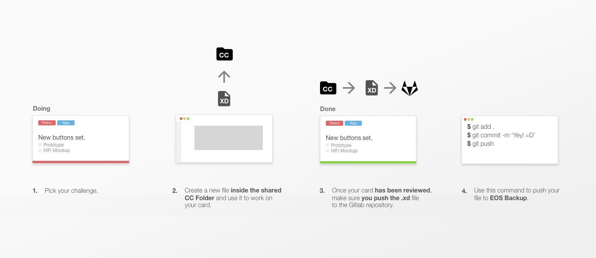

1. [Process](#process)
2. [How does the versioning system work?](#how-does-the-versioning-system-work)
3. [Naming Conventions](#naming-conventions)

## Process


1. Pick your challenge.

2. Create a new file inside the [shared CC Folder](https://adobe.ly/2KP6k9Y) by going to  your local folder "Creative Cloud Files", as shown here:


 and use this file to work your card.   

3. Once your card passes revision and the design moves to development make sure you push the .xd file to Gitlab https://gitlab.com/SUSE-UIUX/eos-backup.

4. Upload the file to the [EOS Backup](https://gitlab.com/SUSE-UIUX/eos-backup) repository by using the following commands:

```
git add .
git commit -m 'Message detailing the change' 
git push
```

Please note that the shared CC folder and the EOS Backup repository **need to be carbon copies of each other**.

[Click here to subscribe to the shared folder](https://adobe.ly/2KP6k9Y)

## How does the versioning system work?
All file versioning and backup will be done via git. An automatic mirroring system has been configured to copy the git repository to another service for backup purposes.

### Working Space
The main repository for our Adobe files is in Gitlab: 
https://gitlab.com/SUSE-UIUX/eos-backup

All work (completed and WIP) will be pushed to this git repository. 

Another repository will automatically copy this git repository as a backup.

## Naming Conventions
Naming conventions help provide a consistent way to find the content at a glance. Consistency within the project is vital. Follow the rules below for naming Adobe files as well as the assets produced from them.

* Do not use capital letters.
* Do avoid "special" characters (: / \ ¢ ™ $ ® [ ] { } ( ) ! ; " ' * ? < > |) and never use spaces, tabs, new lines and embedded returns.
* Do use consistent names for all assets named after what they represent.
* Do match the assets file name to the naming in the source file (group name or layer name, etc.) Being consistent is important in order to improve clarity when looking for a specific item in a psd file.
* Do name all source files after the conceptual piece(s)/component they contain. Examples are "header", "footer", etc.
* Do name files using hierarchy within components. Periods will be used for separating component hierarchy. For example  "main_component.more_specific_component_name".
* Do separate words within one conceptual piece/component. Underscores will be used for separators between words which describe a conceptual piece/component itself. Examples are "header.user_login.psd",  "main_navigation.dropdown_menu.psd", or "main_navigation.accordion.psd".
* Do use a dash "-" to reflect state. Examples are "button-hover" or "checkbox-on".
* Do add the postfix "WIP" to a filename to save work which is unfinished. Only one "WIP" file should be created for a given name.


