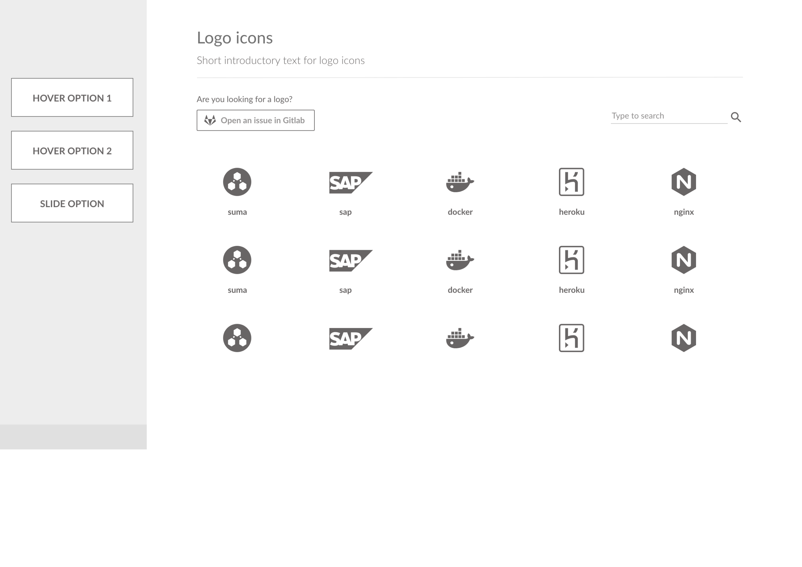

### Design process:

All design cards should follow the full design process as described below:

1). **Research and implement an initial draft or wireframe:** It is important that this initial step is not skipped because it is our best chance to gather information for the main text, elements, and structure of the page. A draft/wireframe should NOT include colors or final styling. The main objective is to learn as quickly as possible and invest as little time as possible designing due to the fact that after having gathered feedback, the wireframe will most likely require changes. Prototyping at this step is also a valid option so your reviewers understand better the path you defined. It is important that you **always present more than one option to the reviewer**. Greater choice will result in better design decisions.

A demo of a wireframe:

(Normally made using digital tools such as Sketch, Adobe XD, or even Photoshop)

A demo of a draft:

(Normally made with pen and paper or on a whiteboard)

2). **Learn what can be improved and design in high-definition:** After having implemented the changes the team suggested in the previous step, and only after the draft/wireframe has been approved or all issues are marked as resolved and your idea is on the right track should you now invest time on colors, shades, and the final visual design. With this, comes prototyping as well. Using the high definition mockups created, the next step is to provide an interactive prototype (in Adobe XD) to bring behavior to your images. As in the previous step, you are required to gather feedback by simply sharing the prototype link on the chat channel.

3) Use one file for all scenarios. If you are creating a mockup for different devices, use artboards within a single file. 

A demo of a high definition mockup:

3). **Help developers implement the design**: Once the prototype is ready and all issues are marked as solved, we begin implementation. This might be part of the same card or in a different card. Either way, the owners of the design should be available to the developer/s implementing the task. 
Ideally, an implementation guide should be delivered (non-compulsory) to better understand sizes, spaces, colors, and more, but when none is available the collaboration and communication between designers and developers must be optimal in order to ease implementation and achieve the required results.

### Feedback gathering:

It is important that all feedback is tracked in tools made for it: Adobe XD. 
Both software are approved to be used by the company and team, and both provide prototyping tools that can be shared among the team:
- Comments allow the team to separate issues in different threads, thus isolating discussions and making them easier to follow up.
- They allow us to resolve issues identified by reviewers, and the tool itself will inform the person creating the issue when new comments are made or the issue is marked as resolved, thus making it easier for team members to mark a prototype as approved.

**Main rules:**

- Always add the link to the Adobe XD prototype to the card in Trello that you are working on.
- When requesting feedback, make sure you only put the link of the Trello card. A bot will automatically assign a reviewer to it. 
- The reviewer's role is to remind the team to have a look at the design and leave feedback. The reviewer will also ensure to give the thumbs up once all comments on a design have been resolved by its author.
- The team members interested in giving feedback will then be able to read the card description and then click on the link to the prototype you created.
- Avoid leaving feedback on Trello if there is a prototype attached to the card. Use Trello for feedback only when no prototype exists.
- The person asking for review **always** removes the XD as they're responsible for it
- Either in order to move to **Done**
- Either in order to move it **To do**