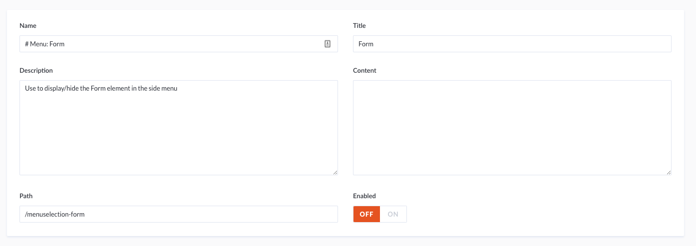

[◀️ Back](https://gitlab.com/SUSE-UIUX/eos/wikis/home#project-setup)


## What we do it
We use [Strapi](https://strapi.io/) as a CMS to define our pages title, descriptions and status (active/inactive).

## How we do
With every request in our Express app, we make use of the middleware (`config-middleware.js`) that will check if a route is defined in Strapi.
The three possible scenarios are the following:
- If the route is defined in Strapi, and the page enabled field it's set to true, the page will be rendered.
- If the route is defined in Strapi and the enabled field it's set to false, it will redirect your requests to `/dashboard`.
- If the route is not defined in Strapi, it will set the document title and description (meta tags) to default values, including setting enabled -used for feature flag- to true (see config-middleware.js).
 
To disallow a route, make sure the pages are defined (Strapi > Pages) and set the `enabled` field to false.

>  **NOTE**: If the environment is development, we ignore all flags because we want to display all pages. We achieve this by passing the same object but with all the enabled values as true.

## Adding items to the menu and submenu.

To add a new element to the main menu and using feature flag, use the following code snippet as an example:
```
li(data-placement='right', title='PAGE_TITLE')
    a.js-select-current-parent.js-feature-flag(href='/PAGE_ROUTE', data-feature-flag= docEnabled['/PAGE_ROUTE'])
      i.eos-icons
        | miscellaneous
      span
        | PAGE_TITLE
```
For the submenu:
```
a.submenu-item.js-select-current.js-feature-flag(href='PAGE_ROUTE', data-feature-flag= docEnabled['PAGE_ROUTE'])
      | PAGE_TITLE
```

## Feature flagging menu sections.
If we want to disable a section in the main menu, create a new page following the structure below: 



Then in the main-menu.pug file, add the feature flagging class:
```
li.menu-item.menu-dropdown.js-feature-flag(data-feature-flag= docEnabled['/menuselection-form'])
//...
```
